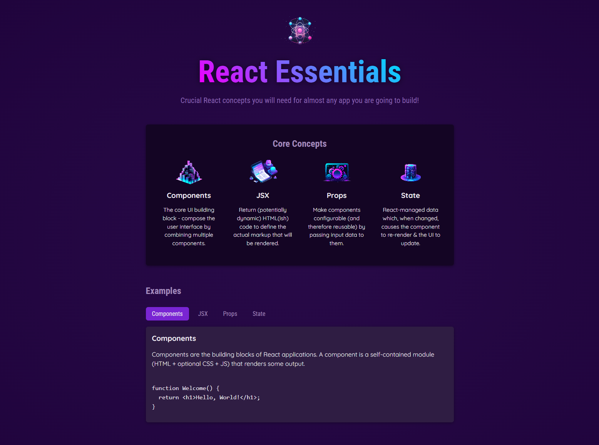

# React Essentials Demo App

[](https://react.dev/)
[](https://vite.dev/)
[](#license)

A small React + Vite learning project that demonstrates foundational React concepts:

- Components
- JSX
- Props
- State

The app renders a Core Concepts section and an interactive Examples section where users can select a topic to view a short explanation and code snippet.

## Screenshot



## Tech Stack

- React 19
- React DOM 19
- Vite 4

## Features

- Displays core React concepts from a shared data source
- Uses reusable components for clean UI composition
- Tab-like topic switching powered by React state
- Conditional rendering for selected example content
- Randomized header description on each render

## Project Structure

```text
.
├── index.html
├── package.json
├── vite.config.js
└── src
	├── App.jsx
	├── data.js
	├── index.css
	├── index.jsx
	├── assets
	└── components
		├── TabButton.jsx
		├── CoreConcept
		│   ├── CoreConcept.css
		│   └── CoreConcept.jsx
		└── Header
			├── Header.css
			└── Header.jsx
```

## Getting Started

### Prerequisites

- Node.js 18+ (recommended)
- npm

### Installation

```bash
npm install
```

### Run Development Server

```bash
npm run dev
```

Then open the local URL shown in the terminal (typically http://localhost:5173).

## Available Scripts

- `npm run dev` - Starts the Vite development server
- `npm run build` - Creates a production build
- `npm run preview` - Serves the production build locally

## How It Works

1. Concept and example content is defined in `src/data.js`.
2. `src/App.jsx` maps concept data into `CoreConcept` components.
3. Topic buttons are rendered with `TabButton` and update component state.
4. Selected topic content is conditionally rendered from the `EXAMPLES` object.

## Learning Goals

This project is useful for practicing:

- Component composition
- Props and reusable UI
- State updates with `useState`
- Conditional rendering patterns
- Data-driven UI rendering with `map`

## License

This project is for educational/demo purposes.